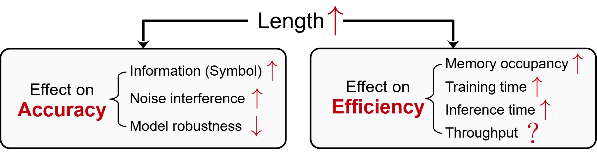
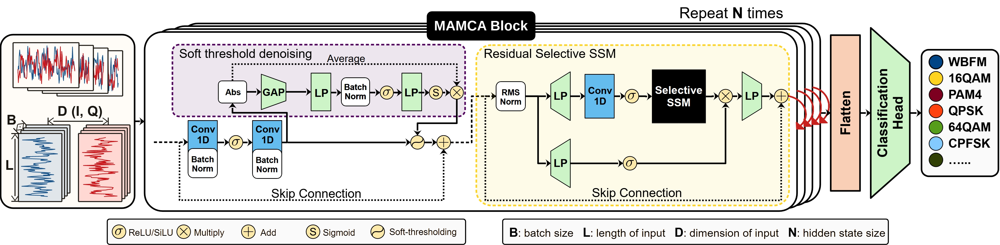

# MAMCA
A method for Automatic Modulation Classification using [Mamba](https://github.com/state-spaces/mamba) structure

A project employing the **Selective State Space Model (Mamba)** method for **Automatic Modulation Classification (AMC)** in a scenario of **extended signal length**.

The increased sequence length complicates the learning process and diminishes accuracy, while simultaneously escalating memories and reduces timeliness. This issue brings the following impacts:



if our codes helped your reasearch, please consider citing the corresponding submission

> @article{zhang2024specific,<br>
> &emsp;&emsp;title={Specific Emitter Identification Handling Modulation Variation with Margin Disparity Discrepancy},<br>
> &emsp;&emsp;author={Yezhuo Zhang and Zinan Zhou and Xuanpeng Li},<br>
> &emsp;&emsp;year={2024},<br>
> &emsp;&emsp;journal={arXiv preprint arXiv:2403.11531},<br>
> }

We utilize a denosing unit for better accuracy performance under **noise interference**, while using Mamba as the backbone for **low GPU occupancy** and **training/inference time**.
- MAMCA structure


To related AMC works, as well as sorce code: 
- Deep Learning Based Automatic Modulation Recognition: Models, Datasets, and Challenges

    [AMR-Benchmark](https://github.com/Richardzhangxx/AMR-Benchmark?tab=readme-ov-file)

To the denosing method employed in our work, as well as source code: 
- IEEE Transactions on Industrial Informatics 2020

    [Deep Residual Shrinkage Networks for Fault Diagnosis](https://ieeexplore.ieee.org/abstract/document/8850096)

- Deep-Residual-Shrinkage-Networks-for-intelligent-fault-diagnosis-DRSN

    [pytorch-Deep-Residual-Shrinkage-Networks (DRSN)](https://github.com/liguge/Deep-Residual-Shrinkage-Networks-for-intelligent-fault-diagnosis-DRSN-)


To the Mamba method employed in our work, as well as source code: 
- arXiv preprint arXiv:2312.00752

    [Mamba: Linear-Time Sequence Modeling with Selective State Spaces](https://arxiv.org/abs/2312.00752)

- mamba

    [mamba](https://github.com/state-spaces/mamba)

## Requirements

```
pip install -r requirements.txt
```

## Training
cd into ```code/script``` and do
    
```python
bash RML2016.10a.sh
```

## Contact

If you have any problem with our code or any suggestions, including discussion on SEI, please feel free to contact

- Yezhuo Zhang (zhang_yezhuo@seu.edu.cn | zhang_yezhuo@outlook.com)
- Zinan Zhou (zhouzinan919@seu.edu.cn)
- Xuanpeng Li (li_xuanpeng@seu.edu.cn)

